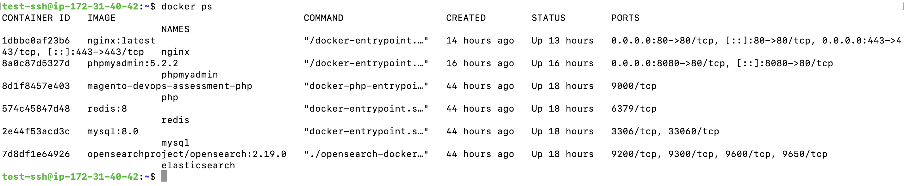
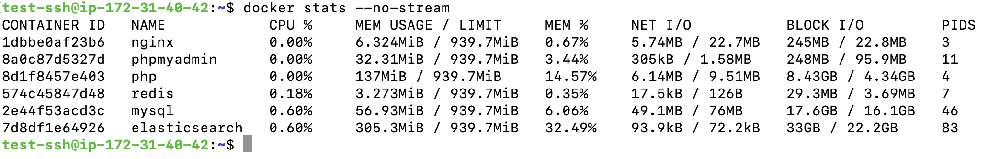
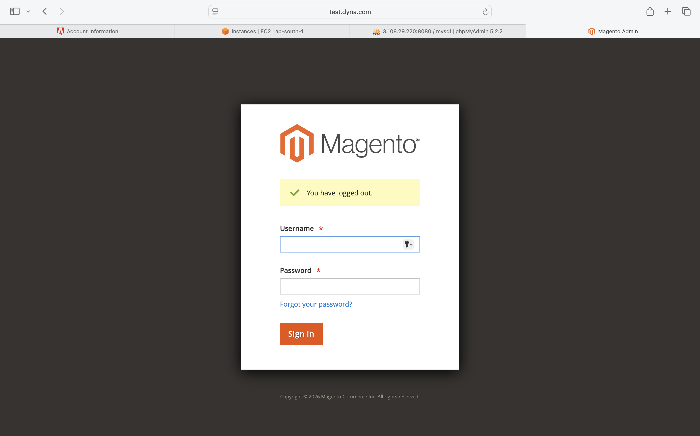
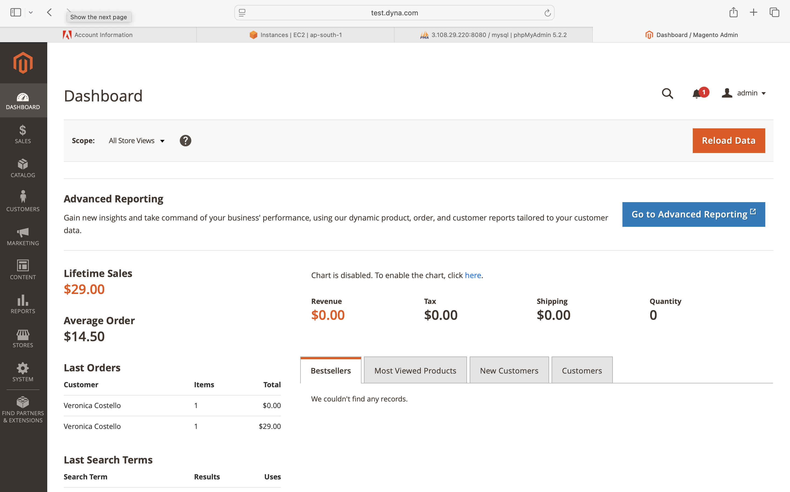
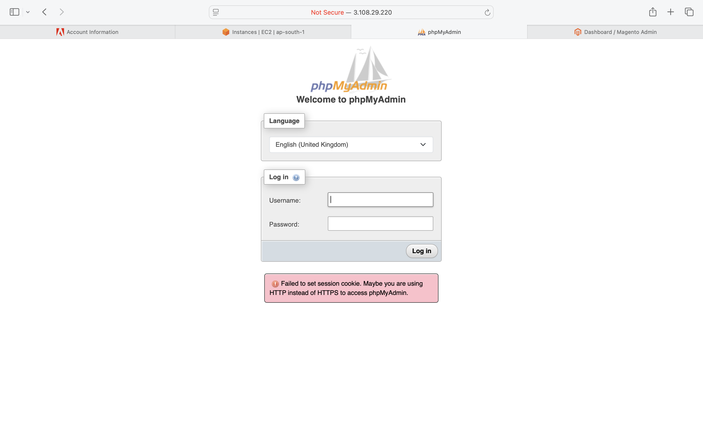

# Magento 2 DevOps Assessment

## Project Overview

This repository contains a production-oriented Dockerized deployment of **Adobe Commerce (Magento 2)** running on an AWS EC2 instance using Docker Compose.

The objective of this implementation was to deploy Magento as a containerized application while following DevOps best practices for service isolation, reproducibility, security, and maintainability.

The deployment consists of dedicated containers for the web server, PHP-FPM, database, cache, search engine, scheduled jobs, and database administration.

The environment was implemented and tested on an **AWS EC2 Debian** instance using **Docker Compose**.

---

# Architecture

```
                        Internet
                            │
                     test.dyna.com
                            │
                  HTTP (80) / HTTPS (443)
                            │
                    ┌──────────────────┐
                    │      NGINX       │
                    └────────┬─────────┘
                             │
                             ▼
                    ┌──────────────────┐
                    │     PHP-FPM      │
                    └────────┬─────────┘
                             │
                        Magento 2
                             │
        ┌──────────────┬──────────────┬──────────────┐
        │              │              │              │
        ▼              ▼              ▼              ▼
     MySQL          Redis        OpenSearch       Cron

                             │
                             ▼
                      phpMyAdmin (Port 8080)
```

---

# Infrastructure

| Component               | Details                    |
| ----------------------- | -------------------------- |
| Cloud Provider          | AWS                        |
| Compute                 | EC2                        |
| Operating System        | Debian Linux               |
| Instance Type           | t3.micro                   |
| Container Runtime       | Docker                     |
| Orchestration           | Docker Compose             |
| Web Server              | NGINX                      |
| Application             | Adobe Commerce (Magento 2) |
| PHP Runtime             | PHP-FPM 8.3                |
| Database                | MySQL 8.0                  |
| Cache                   | Redis                      |
| Search Engine           | OpenSearch                 |
| Database Administration | phpMyAdmin                 |
| Scheduled Tasks         | Dedicated Cron Container   |

---

# Design Goals

The implementation was designed with the following objectives:

* Deploy Magento using isolated Docker containers.
* Separate infrastructure services for easier management and scalability.
* Enable HTTPS access using SSL.
* Configure a custom hostname (`test.dyna.com`) for application access.
* Provide persistent storage for database and search engine data.
* Simplify deployment using Docker Compose.
* Maintain a lightweight deployment suitable for a t3.micro EC2 instance while preserving application functionality.

---

# High-Level Features

* Docker Compose based deployment
* Dedicated PHP-FPM container
* Dedicated NGINX container
* Dedicated MySQL container
* Dedicated Redis container
* Dedicated OpenSearch container
* Dedicated Magento Cron container
* Dedicated phpMyAdmin container
* HTTPS enabled using a self-signed SSL certificate
* Custom hostname configuration (`test.dyna.com`)
* Persistent Docker volumes for stateful services
* Magento sample data installed
* Automated dependency management using Composer

---

# Docker Services

The deployment follows a multi-container architecture where every core Magento component runs inside its own dedicated container. This improves maintainability, simplifies troubleshooting, and follows containerization best practices.

| Service | Image | Purpose | Port |
|----------|-------|---------|------|
| nginx | nginx | Reverse proxy and web server | 80, 443 |
| php | Custom PHP 8.3 FPM | Executes Magento PHP application | 9000 (internal) |
| mysql | mysql:8.0 | Stores Magento database | 3306 |
| redis | redis:8 | Magento cache and session storage | 6379 |
| elasticsearch | opensearchproject/opensearch:2.19.0 | Product search and indexing | 9200 (internal) |
| cron | Custom PHP image | Executes Magento scheduled jobs | Internal |
| phpmyadmin | phpmyadmin:5.2.2 | Database administration | 8080 |

---

## NGINX

Responsibilities

- Serves Magento storefront.
- Terminates HTTPS connections.
- Forwards PHP requests to PHP-FPM.
- Serves static assets.
- Redirects HTTP traffic to HTTPS.

Configuration

- Port 80
- Port 443
- Custom SSL certificate
- Custom hostname (test.dyna.com)

---

## PHP-FPM

Responsibilities

- Executes Magento application.
- Processes dynamic PHP requests.
- Connects to MySQL, Redis and OpenSearch.

Implementation

- Custom Docker image.
- PHP 8.3.
- Required Magento extensions installed.
- Shared application volume with NGINX.

---

## MySQL

Responsibilities

- Stores Magento application data.
- Product catalog.
- Customer information.
- Orders.
- Configuration.

Implementation

- MySQL 8.0
- Persistent Docker volume.
- Dedicated Magento database.

---

## Redis

Responsibilities

- Magento cache backend.
- Session storage.
- Improves application response time.

Implementation

- Dedicated Redis container.
- Persistent Docker volume.

---

## OpenSearch

Responsibilities

- Product indexing.
- Search functionality.
- Catalog filtering.

Optimizations

Because the assessment was deployed on a t3.micro EC2 instance with limited memory, the JVM heap size was reduced to:

- Xms256m
- Xmx256m

This optimization allowed OpenSearch to operate within the available system memory while maintaining Magento search functionality.

---

## Cron

Responsibilities

- Executes Magento scheduled tasks.
- Index maintenance.
- Email processing.
- Background jobs.

Implementation

A dedicated cron container executes:

php bin/magento cron:run

at one-minute intervals.

Note:
For demonstration purposes the cron container was temporarily stopped during final validation to reduce resource consumption on the t3.micro instance while verifying application availability.

---

## phpMyAdmin

Responsibilities

- Database administration.
- Table inspection.
- SQL execution.
- Backup verification.

Access

Port:

8080

Connected directly to the MySQL container through the Docker network.

---

# Deployment Steps

## 1. Clone the Repository

```bash
git clone <repository-url>
cd magento-devops-assessment
```

## 2. Build the Environment

```bash
docker compose up -d --build
```

## 3. Verify Containers

```bash
docker ps
```

Expected containers:

* nginx
* php
* mysql
* redis
* elasticsearch
* cron
* phpmyadmin

## 4. Verify Magento

Open:

```
http://test.dyna.com
```

or

```
https://test.dyna.com
```

## 5. Verify Admin Panel

```
https://test.dyna.com/<admin-uri>
```

## 6. Verify phpMyAdmin

```
http://<EC2_PUBLIC_IP>:8080
```

---

# Docker Volumes

The following persistent Docker volumes are configured.

| Volume             | Purpose                    |
| ------------------ | -------------------------- |
| mysql-data         | MySQL database persistence |
| redis-data         | Redis persistence          |
| elasticsearch-data | OpenSearch persistence     |

---

# Docker Network

All containers communicate through a dedicated Docker bridge network.

```
NGINX
   │
PHP-FPM
   │
├── MySQL
├── Redis
└── OpenSearch
```

This approach isolates application services while allowing secure internal communication.

---

# Validation

The deployment was validated using the following checks.

| Validation                  | Status |
| --------------------------- | ------ |
| Docker containers running   | ✅      |
| Magento homepage accessible | ✅      |
| Magento Admin accessible    | ✅      |
| HTTPS enabled               | ✅      |
| Redis connected             | ✅      |
| OpenSearch connected        | ✅      |
| phpMyAdmin accessible       | ✅      |
| Sample Data installed       | ✅      |
| Docker Compose deployment   | ✅      |

---

# Assessment Requirement Mapping

| Requirement                 | Status          |
| --------------------------- | --------------- |
| Docker Compose              | ✅               |
| Adobe Commerce Installation | ✅               |
| Dockerized Architecture     | ✅               |
| PHP-FPM                     | ✅               |
| NGINX                       | ✅               |
| MySQL                       | ✅               |
| Redis                       | ✅               |
| OpenSearch                  | ✅               |
| Cron Container              | ✅               |
| phpMyAdmin                  | ✅               |
| HTTPS                       | ✅               |
| Custom Hostname             | ✅               |
| Persistent Volumes          | ✅               |
| Docker Networking           | ✅               |
| AWS EC2 Deployment          | ✅               |
| Magento Sample Data         | ✅               |
| Documentation               | ✅               |
| Varnish                     | Not Implemented |

---

# Known Limitations

* A self-signed SSL certificate has been used because the assessment uses a custom test domain (`test.dyna.com`) rather than a publicly owned domain.
* Varnish Cache has not been implemented due to the memory limitations of the AWS t3.micro instance used for the assessment.

---

# Screenshots

The following screenshots are included under the `docs/` directory.

* EC2 Instance
* Docker Containers (`docker ps`)
* Magento Homepage
* Magento Admin Dashboard
* phpMyAdmin
* HTTPS Verification
* Docker Compose Services

---

# Conclusion

This project successfully deploys Adobe Commerce (Magento 2) on AWS EC2 using Docker Compose with a multi-container architecture.

The deployment includes NGINX, PHP-FPM, MySQL, Redis, OpenSearch, phpMyAdmin, and a dedicated Cron container. HTTPS has been configured using a self-signed SSL certificate, persistent Docker volumes have been implemented, and the application has been optimized to run within the resource constraints of a t3.micro EC2 instance.

# Screenshots
---

## Docker Containers



---

## Docker Resource Usage



---

## Magento Homepage


---

## Magento Admin Login



---

## Magento Admin Dashboard



---

## phpMyAdmin



---
# Known Limitations & Future Improvements

This project was successfully deployed and validated on an AWS Free Tier **t3.micro (1 vCPU, 1 GB RAM)** instance. Due to the limited resources available on the Free Tier, a few production-grade requirements were intentionally simplified. These trade-offs are documented below.

## 1. Varnish Cache

The assessment specifies a dedicated Varnish container between NGINX and PHP-FPM.

Due to the memory limitations of the AWS Free Tier instance, running Magento, MySQL, OpenSearch, Redis, PHP-FPM, NGINX, phpMyAdmin and Varnish simultaneously resulted in resource exhaustion and unstable services.

To ensure a stable Magento deployment, Varnish was omitted. In a production environment (2 GB+ RAM), Varnish would be deployed and configured as the Full Page Cache backend using the Magento-generated VCL.

---

## 2. Redis Logical Databases

The assessment recommends using separate Redis logical databases for cache, full-page cache and sessions.

A single Redis instance was deployed to keep the configuration lightweight within the Free Tier environment.

In production, Redis would be configured with separate logical databases to provide better isolation and management.

---

## 3. phpMyAdmin Hardening

phpMyAdmin was deployed as a dedicated container and exposed on port **8080**.

Access was restricted using AWS Security Group rules that only allowed connections from the developer's public IP.

For a production deployment, additional security measures such as HTTP Basic Authentication, reverse proxy protection and IP allow-listing would be implemented.

---

## 4. Non-root Container Users

The assessment recommends running application services as the **test-ssh** user and **clp** group.

The current implementation uses the default users provided by the official container images for compatibility and simplicity.

A production deployment would use custom images with explicit UID/GID mapping to the host user for improved security and consistent file ownership.

---

## 5. Multi-stage Docker Builds

A custom PHP-FPM Docker image was created for Magento.

To keep the implementation simple and reproducible, a single-stage build was used.

In production, Composer dependency installation would be separated into a dedicated build stage to reduce image size and improve build performance.

---

## 6. Monitoring & CI/CD

The assessment focuses on the deployment of the Magento application stack.

Given additional time, the project would be extended with:

* GitHub Actions CI/CD pipeline
* Docker image vulnerability scanning
* Prometheus and Grafana monitoring
* Centralized log aggregation
* Automated infrastructure provisioning using Terraform or Ansible

---

## Conclusion

The primary objective of this assessment was to deliver a reproducible, Dockerized Magento 2 deployment on AWS Free Tier while demonstrating sound DevOps practices.

Where resource constraints prevented full implementation of production-grade features, the trade-offs have been documented together with the recommended production approach.

